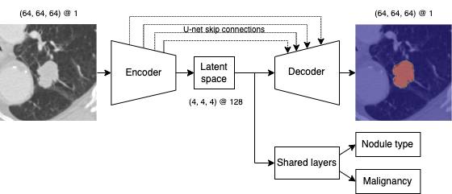

# LUNA23 group 5

## Project description
The goal of this project is to develop a deep learning model that can do three tasks: segmentation, classification and malignancy prediction of pulmonary nodules. The dataset is provided by the LUNA23 challenge, the test set consists of 687 nodules in the training set and 256 nodules in the testing set. Each nodule in the training set has an associated coordinate, diameter, segmentation, nodule type, and malignancy. The test set only contains the images themselves.

## Sctructure of the project
The project is structured as follows:
```
 - 📁 `checkpoints` contains the best model checkpoint
 - 📁 `dataset`
    | - 📁 `train_set` 
    | - 📁 `test_set`
    └ - 📄 `luna23-ismi-train-set` contains labels and metadata
 - 📁 `luna` contains all code related to the model
    | - 📄 `__main__.py` provides a CLI to train the model
    | - 📄 `model.py` contains the model
    | - 📄 `training.py` contains the training loop
    | - 📄 `dataset.py` provides interface to the training data
    | - 📄 `process.py` Is used by the container for infernece
    | - 📄 `utils.py` utility functions 
    └ - 📄 `constants.py` constant settings and facts about input data
 - 📁 `notebooks` varies notebooks for visualization of training and model output
 - 📁 `scripts` contain scripts to train and build the container
    | - 📄 `train.sh` trains the model with sbatch
    | - 📄 `get_dataset.sh` downloads the dataset from surf  
    | - 📄 `build_container.sh` builds the container
    | - 📄 `test_container.sh` tests the container
    └ - 📄 `export_container.sh` exports noduleanalyzer container to a `.tar.gz` 
 - 📁 `test` contains in- output for container testing
 - 📄 `Dockerfile` Instructions to create container
 - 📄 `requirements.txt` contains all dependencies for development
 - 📄 `requirements-container.txt` contains all dependencies for inference
 - 📄 `README.md` this file
```
## Usage

The code of the project is structured in a python module `luna` that provides a convenient
CLI, allowing to train and perform inference with our model, and select various hyperparameters
without making changes in code. 

After installing dependencies with `pip install -r requirements.txt`,
the CLI can be used as follows:

```
# View all training options:
python -m luna train --help

# Minimal way to train with defaults for everything:
python -m luna train --data-dir=dataset --results-dir=results

# A more complete example, that sets some options.
# This will run inference on the test set as well after training.
python -u -m luna train \
    --data-dir=$TMPDIR/dataset \
    --results-dir=$TMPDIR/results \
    --batch-size=16 \
    --epochs=800 \
    --fold=0 \
    --dropout=0.8 \
    --aug-mirror-x \
    --exp-id="try-very-high-dropout-and-mirror-on-the-x-axis" \
    --perform-inference
```

### Container

To create a new algorithm container the latest checkpoint of the model must be placed in `checkpoints/best-model` folder.
We can build the container with the following command:

```bash
./scripts/build_container.sh
```
To test if the container is working properly, we can run the following command:

```bash
./scripts/test_container.sh
```
Exporting the container to a `.tar.gz` file can be done with the following command:

```bash
./scripts/export_container.sh
```

Download the exported container from [surf](https://filesender.surf.nl/?s=download&token=9da18c49-9cef-4b3f-80a5-24efe54d1efa).

## Multi-task model

The model in this code is a multi-task model that combines a 3D U-net with a part for nodule type classification and malignancy prediction. The model architecture is as follows:

Losses are combined by weighted sum: $\mathcal{L}_{total} = w_{seg} \cdot \mathcal{L}_{seg} + w_{type} \cdot \mathcal{L}_{type} + w_{mal} \cdot \mathcal{L}_{mal}$.
Experimentation shows that having equal weights for all tasks works well.

A high-level overview of the model can be seen below.

